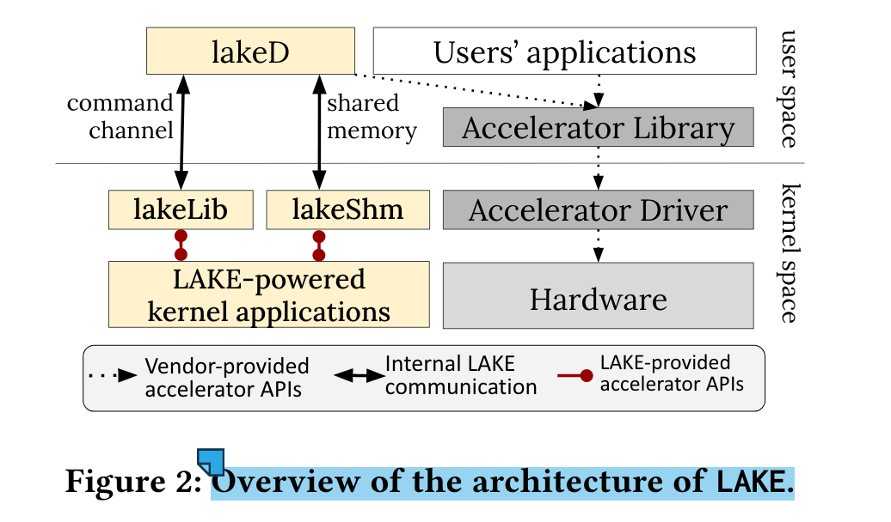

### Paper Reading - LAKE (Learning-assisted Accelerated Kernel)

---

#### Motivations:

1. Only using CPU for ML in OS hinders developers to use potentially computationally expensive algorithms.
2. No clear mechanism is present to manage the contention between kernl ML work and user space work.

#### Challenges:

1. In kernel space, poor accessibility to accelerators like GPUs/TPUs. 
2. The benefit for ML is subsystem-, workload-, and hardware dependent.
3. Data Collection: A fundamental tension exists between abstraction layer boundaries and the need for cross-layer data sharing to expose features.

#### Corresponding Solutions:

1. Uses API remoting to provide kernel space applications with the vendor-supported accelerator interfaces
2. Provides a custom policy interface for contention control that allows the kernel to exploit accelerators or fall back to less intensive and/or CPU-based solutions when contention or lack of performance benefit is predicted by the policy.
3. Provides an in-kernel feature store, which simplifies the task of instromenting kernel subsystems to collect data.

#### Architecture:

1. **lakeLib: **Exposing APIs such as the vendor's user space library of an accelerator as symbols to kernel space.
2. **lakeD: **A Demon listens lakeLib's commands, and translate the commands to the accelerator vendor's library.   
3. **lakeShm: ** Mapping same memory space from kernel space (allow zero-copy memory movement between kernel space modules and lakeD).

#### Other Design

+ Contention Management: Set a threshold for kernel ML's GPU utilization. If the moving average of GPU utilization below the threshold && the batch size(bigger the more benefit GPU acceleration will bring) exceeds the threshold, offload to GPU. Otherwise, directly use CPU.
+ 

